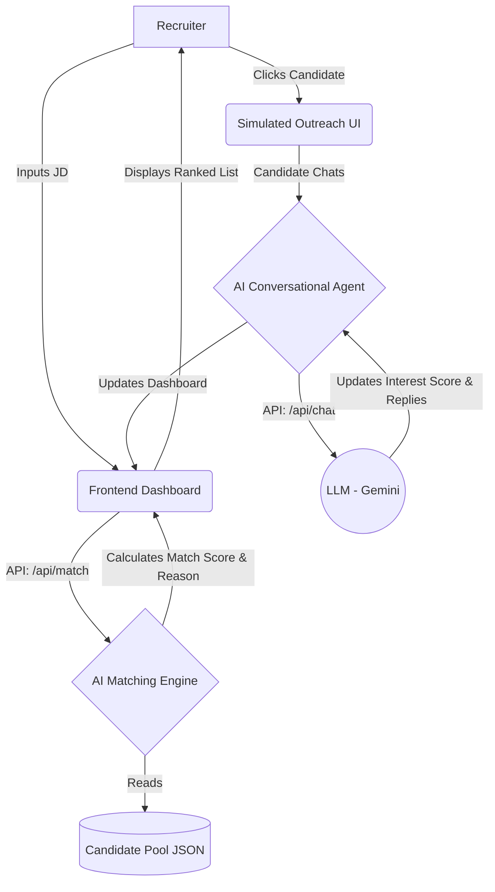

# Catalyst: AI-Powered Talent Scouting & Engagement Agent

Catalyst is an AI agent designed to revolutionize the recruiting process. Instead of manually sifting through resumes and chasing candidate interest, Catalyst takes a Job Description, discovers the best matches, and autonomously engages them conversationally to assess their genuine interest. It then outputs a ranked shortlist scored on two dimensions: Match Score and Interest Score.

## Features
- **Intelligent JD Parsing & Matching**: Uses LLMs to understand deep requirements from a job description and scores candidates with a transparent "Match Explanation".
- **Autonomous Engagement**: Simulates a conversational outreach where the AI Recruiter talks to the candidate to gauge their enthusiasm and salary expectations.
- **Dynamic Scoring System**: Calculates a "Match Score" (how well skills align) and an "Interest Score" (how engaged the candidate is), combining them into an overall ranking.
- **Premium UI**: Built with Next.js, Tailwind CSS, and Framer Motion for a stunning, recruiter-friendly experience.

## Architecture & Logic

### Scoring Logic
- **Match Score (0-100)**: Calculated by the LLM by comparing the candidate's skills, experience, and role against the nuanced requirements in the JD.
- **Interest Score (0-100)**: Calculated by the LLM during the chat. It analyzes the sentiment, responsiveness, and alignment of the candidate's replies.
- **Combined Score**: The final ranking uses a weighted formula: `(Match Score * 0.6) + (Interest Score * 0.4)`. Unassessed candidates default to just their Match Score weight.

## Local Setup Instructions

1. **Clone the repository** (or extract the folder).
2. **Install dependencies**:
   \`\`\`bash
   npm install
   \`\`\`
3. **Configure the AI (Required for full experience)**:
   - Get a free API key from [Google AI Studio](https://aistudio.google.com/).
   - Create a \`.env.local\` file in the root directory:
     \`\`\`env
     GEMINI_API_KEY=your_api_key_here
     \`\`\`
     *(Note: If no key is provided, the app will use built-in fallback mock logic so you can still test the UI!)*
4. **Run the development server**:
   \`\`\`bash
   npm run dev
   \`\`\`
5. Open [http://localhost:3000](http://localhost:3000) with your browser.

## Sample Inputs and Outputs
- **Input JD**: "Looking for a Senior Full Stack Engineer with 5+ years of React, Node.js, and AWS experience. Must be comfortable with microservices."
- **Matching Output**: The dashboard will surface "Alex Rivera" (7 years exp, React/Node/AWS) with a 95% Match Score and an explanation: *"Strong match due to background in React and Next.js which aligns with the JD."*
- **Chat Simulation Input**: (As candidate) "Yes, I am very interested! What is the salary range?"
- **Chat Output**: The AI replies with details, and the candidate's Interest Score jumps to 85% on the dashboard.

---
Built for the Deccan AI Catalyst Hackathon.
